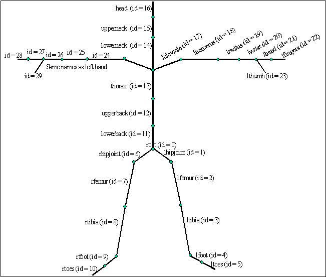
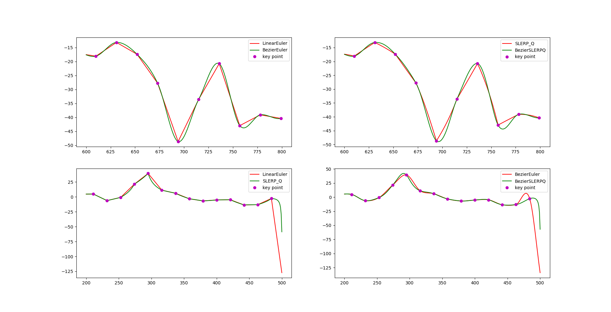

# Motion Capture Interpolation

This project is programmed in C++, run on Windows,Mac and Linux with C++ compiler.\
Before executing the code, you can check the details of this project in http://barbic.usc.edu/cs520-s21/assign2/
```
for OSX and Linux:
    To run mocaplayer(create a window to show the motions):
    run $./mocaplayer in the command line
    To run interpolators:
    run $./interpolate [skeleton file name].asf [motion file name].amc [l/b] [e/q] [N for keyframe interval] [outfilename].amc
    For example 
    To interpolate 131_04-dance.amc in bezier SLERP quaternion interpolation with a keyframe interval of 20 and out put to a file called dance_bq.amc, the command line should be:
    $./interpolate 131_dance.asf 131_04-dance.amc b q 20 dance_bq.amc
```
This project's main object is to interpolate the given motion with different interpolate strategies--Linear interpolation for Euler angle, Bezier interpolation for Euler angles, SLERP interpolation for quaternions and Bezier interpolation for SLERP quaternions.
The linear interpolation for Euler angles are already given, so we need to implement the other 3 interpolations and compare the speed and accuracy of the 4 interpolation schemes.

The inputs are skeleton files and motion files. 
The skeleton file (ASF) describes how the bones in the skeleton are connected, and their degrees of freedom (see Figure 1 for a representative skeleton). All bones are described in the ":bonedata" section of this file. Each bone has the following fields:
```
begin
id bone_id                  //Unique id for each bone
name bone_name        //Unique name for each bone
direction dX dY dZ    //Vector describing direction of the bone in world coordinate system
length 7.01722           //Length of the bone
axis 0 0 20 XYZ         //Rotation of local coordinate system for
                                   //this bone relative to the world coordinate
                                   //system. In AMC file the rotation angles
                                    //for this bone for each time frame will be
                                   //defined relative to this local coordinate
                                    //system (see Figure 2)
dof rx ry rz                //Degrees of freedom for this bone.
limits (-160.0 20.0)
            (-70.0 70.0)
            (-60.0 70.0)
end
```
The parent/child relationship among all bones in skeleton hierarchy is defined in the ":hierarchy " section of the ASF file. Each line list the parent first, then its children.
For example:
"root lhipjoint rhipjoint lowerback"
Root is a parent and lhipjoint, rhipjoint, lowerback are root's children.



The motion file (AMC) gives each bone's rotation angles (in Euler angles) relative to the bone's reference local coordinate system. The bone's reference local coordinate system is defined in the skeleton (ASF) file. One entry is given for each frame, at a frame rate of 120 fps.

Displaying the animation

First load the skeleton (ASF) file. Then load the motion (AMC) file. Press play button to view the motion.

Compare the 4 different schemes:



Runtime of Linear Euler interpolation: 0.012171s
Runtime of Bezier Euler interpolation: 0.035498s
Runtime of SLERP quaternion interpolation: 0.077510s
Runtime of Bezier SLERP quaternion interpolation: 0.172793s
runtime screenshots in ./pics/runtime/

```
Given the observation above, Bezier interpolation is better than Linear interpolation in most times because the curve of Bezier interpolation is closer to the input frame curve. But the Linear interpolation can be calculated faster than Bezier interpolation. Quaternion’s advantage against Euler is the rotation represents by quaternion is smoother than euler angle. The Quaternion also don’t have gimble lock problem that appears in Euler angles. However, quaternions are harder to implement and also need more time to calculate when use.
```